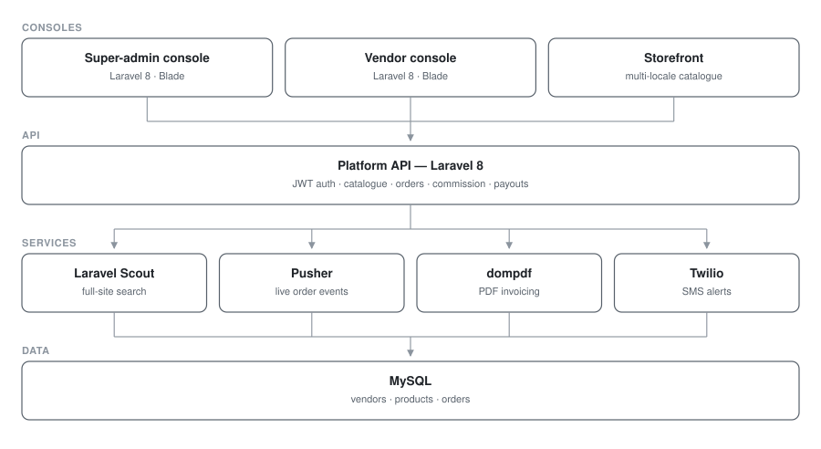

# Storak — Multi-Vendor eCommerce Platform

**Multi-vendor marketplace · Laravel 8 · 3 services**

A marketplace where independent vendors run their own storefronts under one platform, with shared catalogue, commission, invoicing and fulfilment.

> **Source code is private.** This repository documents the architecture and engineering work.

## My role
Backend engineer

## Architecture

| Service | Stack | Responsibility |
|---|---|---|
| Platform API | Laravel 8, JWT (`tymon/jwt-auth`) | Catalogue, orders, payments, search |
| Super-admin console | Laravel 8, Blade | Vendor approval, commission, platform settings |
| Vendor console | Laravel 8, Blade | Per-vendor products, orders, invoices, payouts |

### Service topology

## Engineering highlights

**Full-site search.** Laravel Scout with a full-site search driver indexes products, vendors and content behind one query endpoint, with `spatie/laravel-json-api-paginate` for stable cursor pagination across large catalogues.

**Bulk write performance.** `mavinoo/laravel-batch` for mass catalogue updates — vendor CSV imports touching thousands of rows run as batched writes instead of per-row saves.

**Deep relational modelling.** `staudenmeir/belongs-to-through` to traverse vendor → store → product → variant chains without N+1 blowups; `doctrine/dbal` for runtime schema changes.

**Real-time order events.** Pusher pushes order state transitions to vendor dashboards as they happen.

**Documents and media.** Server-side PDF invoicing (`laraveldaily/laravel-invoices`, `barryvdh/laravel-dompdf`, wkhtmltopdf) and on-the-fly image transformation via `intervention/image`.

**Localisation.** Automated catalogue translation through `stichoza/google-translate-php`, letting vendors publish into multiple locales from a single product entry.

**Notifications.** Twilio SMS for order and delivery updates.

## Screenshots

<!--  -->
<!--  -->
<!--  -->

_Screenshots pending — see `docs/README.md`._

## Stack

`Laravel 8` · `PHP` · `MySQL` · `JWT` · `Laravel Scout` · `Pusher` · `Twilio` · `Blade` · `CKEditor` · `TinyMCE` · `dompdf`
